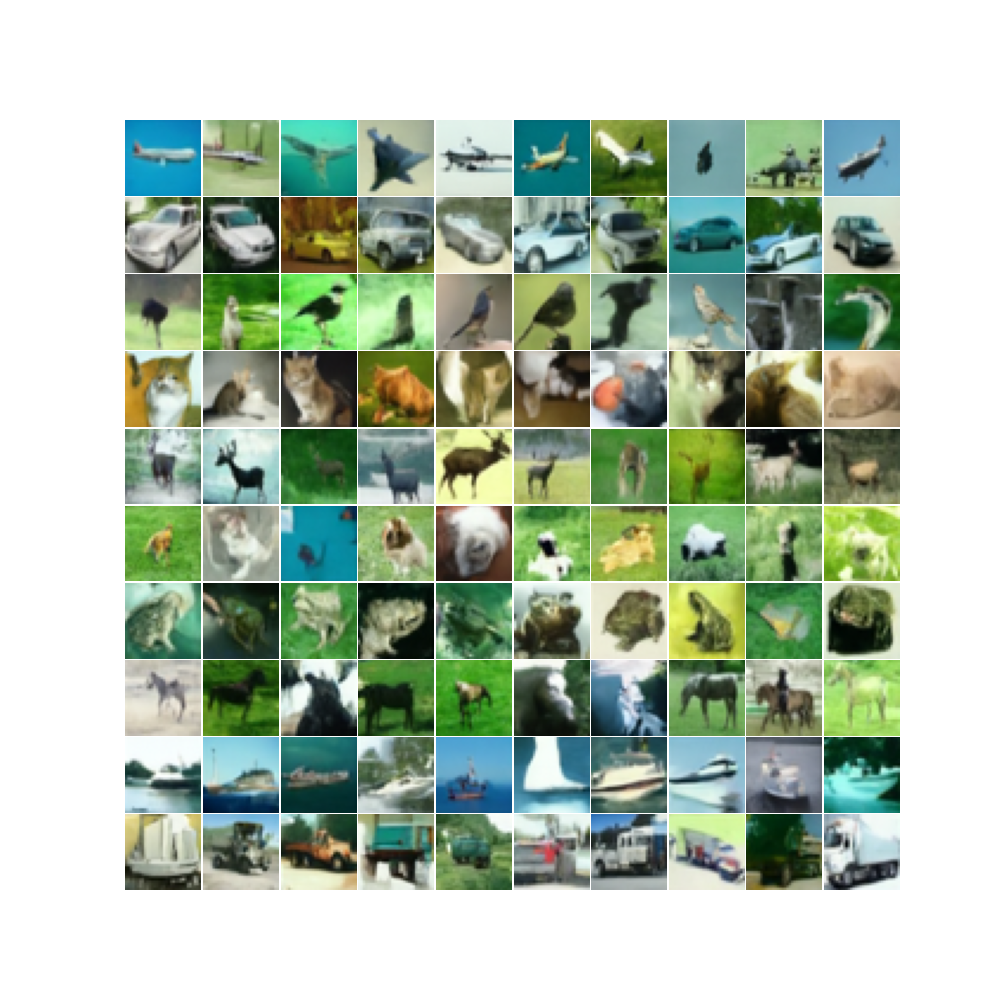

# CIFAR-10 Diffusion (Improved DDPM)

A clean PyTorch implementation of an **Improved Denoising Diffusion Probabilistic Model** trained on **CIFAR-10**.  
Includes full forward/reverse diffusion logic, cosine beta schedules, BigGAN-style residual blocks, attention, class conditioning, checkpointing, and mixed-precision training.

---

## Features
- Class-conditional U-Net (`model.ImprovedDDPM`)
- Cosine beta schedule (Improved DDPM)
- Forward diffusion (`q_sample`)
- Reverse sampling (predict x₀ → posterior mean)
- BigGAN-style ResBlocks + Attention
- EMA (Exponential Moving Average)
- AMP (mixed precision) training
- Clean modular structure

## Results

The following grid was generated by the EMA model after **150 epochs** of training on CIFAR-10 using the configuration below:

<p align="center">
  
</p>

---

## Repository Structure
```
project/
│ train.py
│ load_model.py
│ config.py
│ README.md
│ .gitignore
│
├── model/
│ └── model.py
│
├── blocks/
│ ├── bigGan.py
│ ├── attention.py
│ ├── sample.py
│ └── adaGn.py
│
├── diffusion/
│ ├── forward.py
│ ├── reverse.py
│ └── schedules.py
│
├── embeddings/
│ └── sinusoidal.py
│
├── data/
│ ├── load.py
│ └── cifar_classes.py
│
└── utils/
├── ema.py
├── load_model.py
└── plot_and_save.py
```

## Requirements
- Python 3.10+
- PyTorch (CUDA recommended)
- torchvision  
- matplotlib  
- numpy  

## Training
python -m train

Key configuration lives in config.py:

- DEVICE
- NUM_DIFFUSION_STEPS
- MODEL_CHANNELS / CHANNEL_MULTIPLIERS
- EPOCHS
- BETA_SCHEDULE
- SAVE_DIR

## Sampling / Generating Images
python -m load_model

The script:
- Loads checkpoint
- Runs diffusion.reverse.reverse
- Saves a grid via utils.plot_and_save.save_image_grid

## Key Formulas

Beta schedule (cosine improved DDPM) converts cumulative α product to betas:

$$
\beta_t = 1 - \frac{\bar{\alpha}_{t+1}}{\bar{\alpha}_t}
$$

Implemented in:  
`diffusion/schedules.make_beta_schedule`

## Forward Diffusion (q_sample)

$$
x_t = \sqrt{\bar{\alpha}_t}\, x_0 + \sqrt{1 - \bar{\alpha}_t}\, \epsilon
$$

Implemented in:  
`diffusion/forward.q_sample`

---

## Reverse Diffusion Posterior Mean

$$
\mu_t =
\frac{\sqrt{\bar{\alpha}_{t-1}}\, \beta_t}{1 - \bar{\alpha}_t}\, \hat{x}_0
\;+\;
\frac{\sqrt{\alpha_t}\,(1 - \bar{\alpha}_{t-1})}{1 - \bar{\alpha}_t}\, x_t
$$

Implemented in:  
`diffusion/reverse.reverse`

## References

**Ho et al., 2020 — Denoising Diffusion Probabilistic Models (DDPM)**  
Ho, J., Jain, A., & Abbeel, P. (2020). *Denoising Diffusion Probabilistic Models.*  
arXiv:2006.11239

https://arxiv.org/abs/2006.11239

---

**Nichol & Dhariwal, 2021 — Improved Denoising Diffusion Probabilistic Models (Improved DDPM)**  
Nichol, A. Q., & Dhariwal, P. (2021). *Improved Denoising Diffusion Probabilistic Models.*  
arXiv:2102.09672

https://arxiv.org/abs/2102.09672